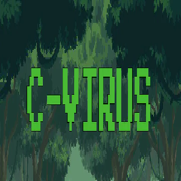

# Toontens (em desenvolvimento)

## Historia

O Cvirus é um jogo que mescla um infinity runner com um plataform 2D onde o jogador controla um cientista que luta contra o Cvirus. Esse jogo foi criado para uma GameJAm onde a equipe tinha 1 semana para criar e finalizar o jogo.

## Genero

Jogo 2D Infinity Runner/Plataform

## Mecanicas

- **Lançamento de projetil**

- **Parallax/scrolling background**

- **Boss com diferentes mecanicas**

- **Tipos de jogos diferentes em um mesmo jogo**

 
 

