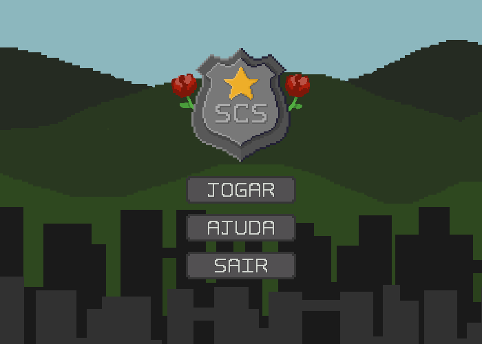
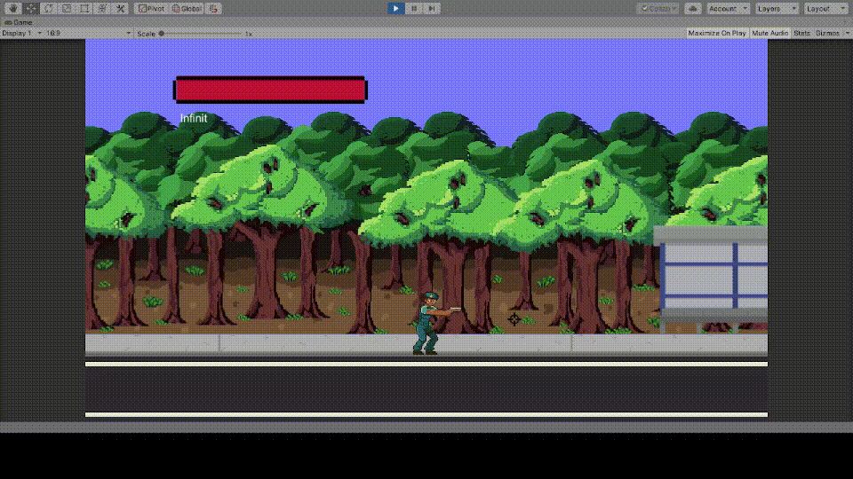
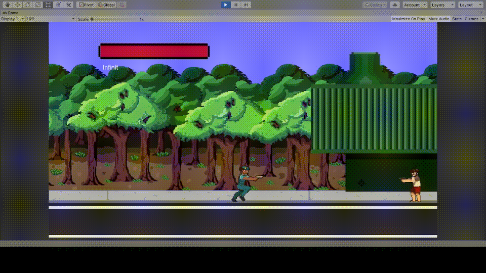
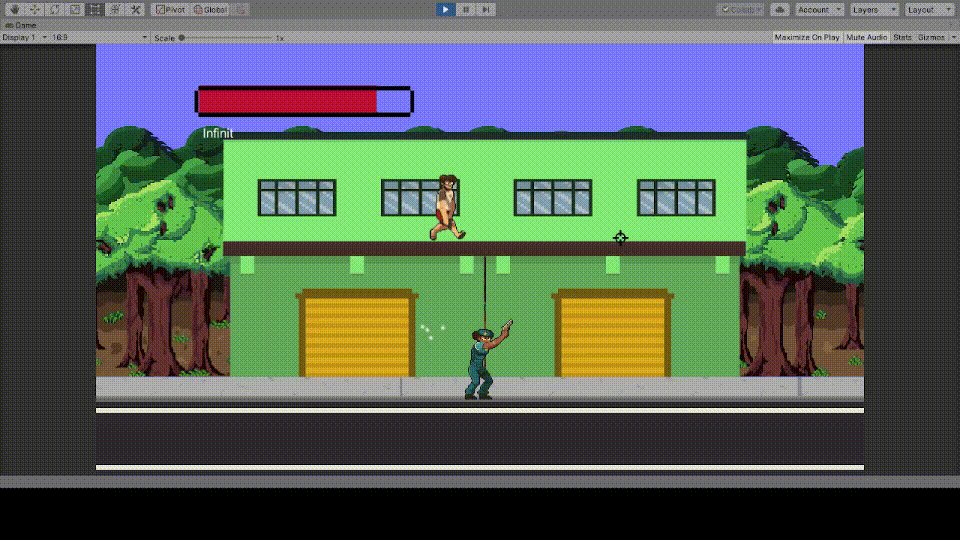

# Santa Cruz Steel (em desenvolvimento)

## Historia

O Santa Cruz Steel é um jogo que relata a saga de Solange que procura resgatar seu filho. Ele tem como premissa a denuncia em relação à violência que acomete as cidades da região do Vale do Aço, Minas Gerais, principalmente aquela gerada pelo trafico de drogas. 

## Genero

Jogo 2D de tiro-plataforma

## Mecanicas

- **Mira de 15° em 15°**

- **Rolamento**

- **IA Precisa no controle dos inimigos (mirar/atirar/movimentar)**

- **Diferentes Puzzles e desafios**

- **Bosses com diferentes mecanicas**

- **Lançamento de projetil**

- **Ataques de forma senoidal**

- **Identificador de plataformas**

- **Explorando o uso de joints para diferentes mecanicas**

