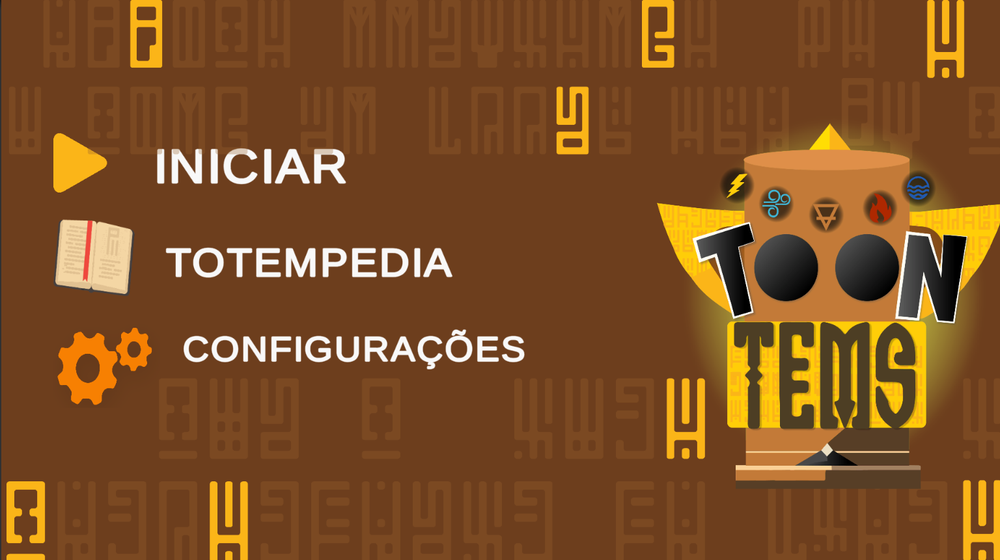

# Toontens (em desenvolvimento)

## Historia

O Toontens é um jogo de tower defense 2D onde o jogador forma seu proprio caminho com os totens(torres) e utiliza diferentes elementos combinando totens elementais para formar novos e mais poderosas defesas. Esse jogo é um produto interno da [CommitJr](https://commitjr.com/) 

## Genero

Jogo 2D TowerDefense

## Mecanicas

- **PathFind A Estrela**

- **O player que define o caminho da grid**

- **As torres(totens) utilizam algoritimos de otimização para encontrar e definir os inimigos divindo eles em quadrantes**

- **Os totens pode ser evoluidos para outros elementos e posteriormente combinados**

- **Cada elemento possui uma mecanica unica**

- **Pode haver obstaculos impedindo o caminho**

