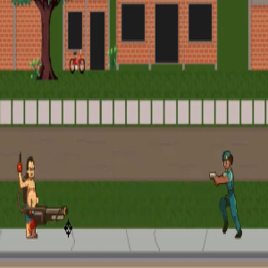
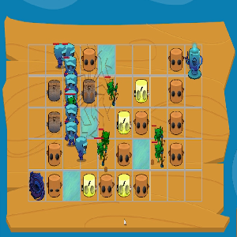
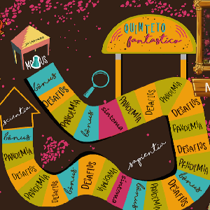

# GameDemos

Nesse repositorio se encontra todas as demos de jogos constados no meu portifolio [click here](https://marceloricoy.github.io/gamedevportfolio/#) assim como detalhes de cada projeto,exemplos,mecânicas,explicações e contextualização.